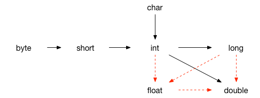

## 数据类型

### 基本数据类型

- 数值型
    - 整数类型：byte、short、int、long
    - 浮点型：float、double
- 字符型（char）
- 布尔型（boolean）

1 字节等于 8 位的二进制数。1KB=1024B；1MB=1024KB=1024×1024B，1B（byte，字节）= 8 bit

- byte：1 个字节，即 8 位二进制表示
- short：2 个字节
- int：4 个字节，比如 123 
- long：8 个字节，比如 123L、123l
- float：4 个字节，单精度浮点型，比如 1.23f、1.23F
- double：8 个字节，双精度浮点型，比如 1.23
- char：2 个字节，使用单引号
- boolean：1 个字节，比如 true、false

### 引用数据类型

- 类（class）
- 接口（interface）
- 数组

### 字符串类型

- String 

### 类型转换

- 自动类型转换
- 强制类型转换

整型和长整型转换为浮点型时，可能存在数据丢失情况。 

 