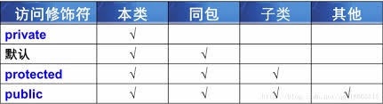

## 面向对象

创建类，实例化对象，单一职责原则。

对象实例化的过程：
- 声明对象 `Constructor one`。声明对象实际是在栈开辟一个空间放 one 变量，`one = new Constructor()` 赋值时，把栈地址 0x0001 给 one。
- 实例化对象 `new Constructor()`。在堆内存中开辟一个空间 0x0001 存放对象。


构造方法
- 构造方法与类名相同，且没有返回值
- 构造方法的语句格式
- 只能在对象实例化的时候调用，不能再类内部调用
- 当没有指定构造方法时，系统会自动添加无参的构造方法
- 当有指定的构造方法，无论是有参、无参的构造方法，都不会自动添加无参的构造方法
- 一个类中可以有多个构造方法

```
public 构造函数方法名() {
    // 初始化代码
}

// 无参构造
public Cat() {

}
// 有参构造
public Cat(String name, int month, double weight, String species) {
    this.name = name;
}
```

### 封装

特点：
- 只能通过规定的方法访问数据
- 隐藏类的实例细节，方便修改和实现

**封装实现步骤**：
- 修改属性的可见性，设为 `private`，实例访问不到该属性，是类的私有属性
- 创建 `getter/setter` 方法，设为 `public` 用于属性的读写
- 在 `getter/setter` 方法中加入属性控制语句，对属性值合法性进行判断 


**static 关键字**：
- static + 属性 => 静态属性、类属性
- static + 方法 => 静态方法、类方法
- 可以通过类名方式访问静态成员，也可以通过实例访问
- 静态方法中不能使用 this
- 静态方法中不能直接访问非静态成员，可以访问静态成员
- 不存在静态类
- 不存在方法中的静态局部变量
- 静态成员的生命周期，类加载时产生，销毁时释放，生命周期长
- 静态代码块不管实例化多少次，只会执行一次；构造代码块在每次对象构造的时候调用


**导入包方法**：
```
// 加载 obj.animal 包下所有的类
import obj.animal.*;
 
// 加载 obj.animal 包下 Cat 类
import obj.animal.Cat; 

//方法 3：直接加载 obj.animal.Cat 类
obj.animal.Cat myCat = new obj.animal.Cat()
```


### 继承 
 
- 子类可以获取到父类的非 `private` 属性，可以通过 `get/set` 方式
- 子类重写的方法可以覆盖父类中方法
    - 方法名、返回值完全与父类相同
    - 子类中方法的修饰符权限必须大于等于父类修饰符权限（`private` < 默认 < `protected` < `public`）
    - 参数名可以不同 
- 子类属性也可以重写父类中的属性


**访问修饰符：**
- `private`：只允许在本类中访问
- 默认：允许在当前类、同包子类、跨包都不允许
- `protected`：允许在当前类、子类、同包非子类、跨包非子类不允许
- `public`：允许在任意位置访问



访问修饰符不影响成员加载顺序，跟书写位置有关。

继承后的初始化顺序
- 父类静态成员
- 子类的静态成员
- 父类对象构造
- 子类对象构造


**super 关键字**：
- 访问父类成员方法  `super.pint()`
- 访问父类属性 `super.name`
- 访问父类构造方法 `super()`


子类的构造过程中必须调用其父类的构造方法。如果子类的构造方法中没有显示标注，则系统默认调用父类无参构造方法。
使用 super 调用父类指定的构造方法，必须在子类的构造方法的第一行。

this 和 super 都不能在静态方法中使用。

Object 类是所有父类的父亲。

**final 关键字**：
- 修饰类时：表示该类没有子类，不能被继承
- 修饰方法时：不被子类重写
- 修饰属性时：
    - 内部局部变量：只要在具体被使用之前赋值即可，一旦赋值不允许被修改
    - 类中成员属性：赋值过程：1、定义时候直接初始化 2、构造方法 3、构造代码块


`@Override` 表示在子类重写父类方法的注解，编译时会去除

### 多态