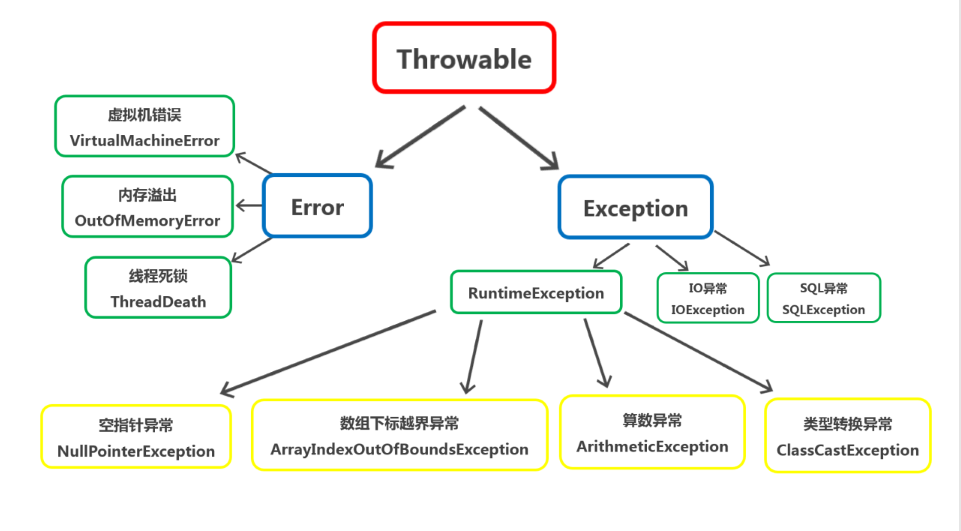
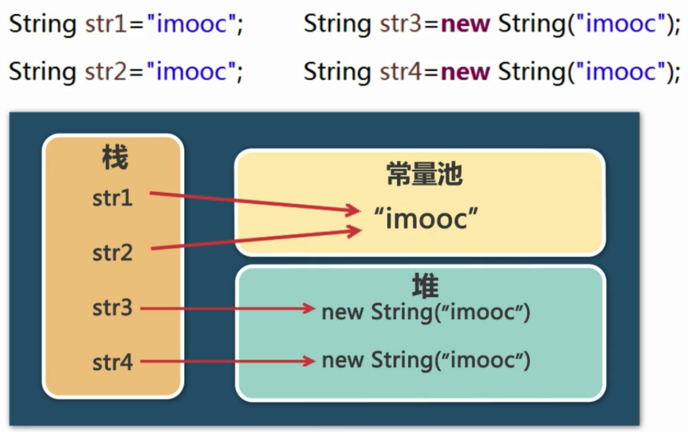

## 异常

语句格式：`try {} catch() {} finally {}` 语句

如果 `finally` 内有 `return` 语句，则会忽略 `try` 和 `catch` 语句内的 `return` 语句。

抛出异常：`throw`、`throws` 语句

通过 `throws` 抛出异常，针对可能出现的多种异常情况
```
方法名 throws ArithmeticException, InputMismatchException
```

`throw` 抛出异常
```
throw new Exception();
```

当子类重写父类抛出异常方法时，声明的异常必须是父类方法所声明异常的同类或子类。




## 包装类

装箱：基本数据类型 -> 包装类
拆箱：包装类 -> 基本数据类型


## String

创建 String 对象

```
String str1 = "abc";
String str2 = new String();
String str3 = new String("abc")
```



`String` 具有不可变性，`StringBuilder` 不具备。当频繁操作字符串时，使用 `StringBuilder`。


## 集合 

应用场景
- 无法预测存储数据的数量
- 同时存储具有一对一关系的数据
- 需要进行数据的增删
- 数据重复问题

### List

**`ArrayList`**：
- `ArrayList` 底层是由数组实现的
- 动态增长，以满足应用程序的需求
- 在列表尾部插入或删除数据非常有效
- 更适合查找和更新元素
- `ArrayList` 中的元素可以为 `null`


### Set

**`HashSet`**：
- 是 Set 的一个重要实现类
- `HashSet` 的元素无序并且不可以重复

### Map

Map 中的数据都是以键值对（key-value）的形式存储的。

**HashMap**：
- 基于哈希表的 Map 接口的实现
- 允许使用 `null` 值和 `null` 键
- key 值不允许重复
- HashMap 的 Entry 对象是无序排列的

